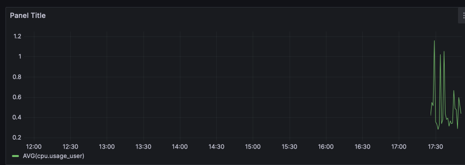

# The latest README.md

## CnosDB data source for Grafana

本篇文档将向您描述 CnosDB 数据源插件的安装、配置，以及配置查询并可视化查询结果。

## Installation

搜索 cnosdb，可以看到如下的搜索结果，点击搜索到的 **CnosDB** 卡片即可进入配置界面。：

----------

> 在最新的版本中，我们在修改了配置界面中的一些元素，原来的 URL 输入框现在被拆分为输入框 **Host** 与 **Port** 与开关 **SSL**，默认情况下 **SSL** 为关闭状态，等同于 `http://{HOST}:{PORT} `，当打开 **SSL** 时，等同于 `https://{HOST}:{PORT}`。

- **HOST** - CnosDB 实例的主机地址。
- **PORT** - CnosDB 实例的 HTTP 服务端口，当 **SSL** 关闭时默认为 80，打开 **SSL** 时默认为 443。
- **USER** 与 **PASSWORD** - 原来的输入框 **User** 与 **Password** 现在被移动至 **Auth** 下方，需要将开关 **Basic Auth** 打开才能输入。0
- **Tenant** - 输入租户名称。
- **Database** - 输入数据库名称。
- **With CA Cert** - 使用 CA 证书加密传输。
- **Skip TLS Verify** - 允许不安全的加密连接。

并且额外增加了一些 CnosDB 查询的优化参数：

- **Target partitions** - 查询并行度相关配置。
- **Stream trigger** - 微批数据传输的触发间隔，如 `10s`、`1m` 等。
- **Chuncked** - 是否分块返回查询结果。

填写表单后，点击 **Save & test** 按钮，若出现的提示框汇中有 **Data source is working** 文本，说明已经配置成功，可以后续进行查询。

----------

我们还为连接 CnosDB 云服务提供了一个单独的配置界面，点击 **Name** 输入框下方的切换按钮 **CnosDB Cloud** 即可进入。

## Usage

> Official document on how to use grafana dashboard: [Use Dashboards](https://grafana.com/docs/grafana/latest/dashboards/use-dashboards/).

导航至 **Dashboards**, 点击右上角的 **New** / **New dashboard**，在弹出界面中点击 **Add visualization**，之后数据源选择 **CnosDB** 就可以进入 CnosDB 的查询配置界面了。

点击 **FROM** 右侧区域选择表：

点击 **SELECT** 右侧区域选择查询的列：

之后就可以看到查询结果了

----------

调整查询的时间范围（右上角）、时间精度（**GROUP BY** 右侧的 time 中的字符串）等配置项，完善你的可视化图表：

